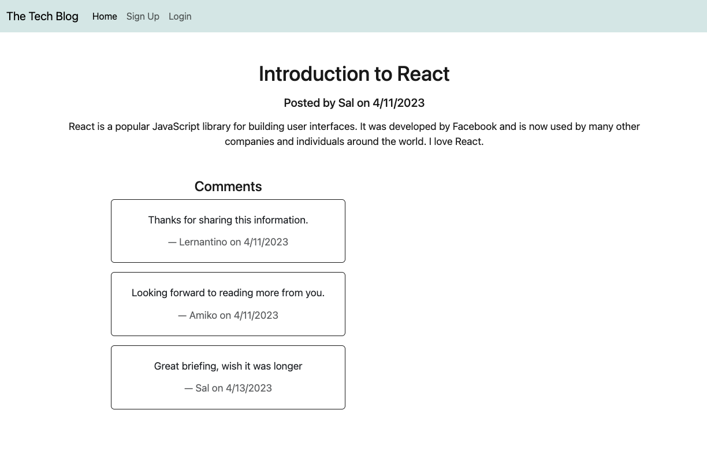

# Talk Techy to Me: Tech Blog

## TABLE OF CONTENTS 

[Description](#description)

[Installation](#installation)

[Screenshots](#screenshots)

[Links](#links)

[Credits](#credits)

[License](#license) 

[Questions](#questions)

## Description

This is a CMS-style blog site where developers can publish their blog posts and comment on other developers' posts. It uses Handlebars.js as the templating language, Sequelize as the ORM, and the express-session npm package for authentication.

## Installation

To install this project, clone the repository from GitHub and open it in your own IDE. Within your terminal, run "npm i" to install the dependencies. Then sign in to your mySQL account using mysql -p and "source db/schema.sql" then quit. Next in terminal type "npm run seed". Once this is done, type "npm start" to start the applicaiton.

## Screenshots

## Links

[Deployed site](https://obscure-dusk-87979.herokuapp.com/)

## Credits

Thank you to my tutor Dominque Meeks Gombe and Eric Jones.

## License

MIT License
      Copyright (c) 2023 Meljska-Fawn
      
      Permission is hereby granted, free of charge, to any person obtaining a copy
      of this software and associated documentation files (the "Software"), to deal
      in the Software without restriction, including without limitation the rights
      to use, copy, modify, merge, publish, distribute, sublicense, and/or sell
      copies of the Software, and to permit persons to whom the Software is
      furnished to do so, subject to the following conditions:
      
      The above copyright notice and this permission notice shall be included in all
      copies or substantial portions of the Software.
      
      THE SOFTWARE IS PROVIDED "AS IS", WITHOUT WARRANTY OF ANY KIND, EXPRESS OR
      IMPLIED, INCLUDING BUT NOT LIMITED TO THE WARRANTIES OF MERCHANTABILITY,
      FITNESS FOR A PARTICULAR PURPOSE AND NONINFRINGEMENT. IN NO EVENT SHALL THE
      AUTHORS OR COPYRIGHT HOLDERS BE LIABLE FOR ANY CLAIM, DAMAGES OR OTHER
      LIABILITY, WHETHER IN AN ACTION OF CONTRACT, TORT OR OTHERWISE, ARISING FROM,
      OUT OF OR IN CONNECTION WITH THE SOFTWARE OR THE USE OR OTHER DEALINGS IN THE
      SOFTWARE.

## Questions

Any Questions regarding this project can be directed to me personally. You can find me at [github](https://github.com/Meljska-Fawn) or send me an email at meli.explores@gmail.com.
